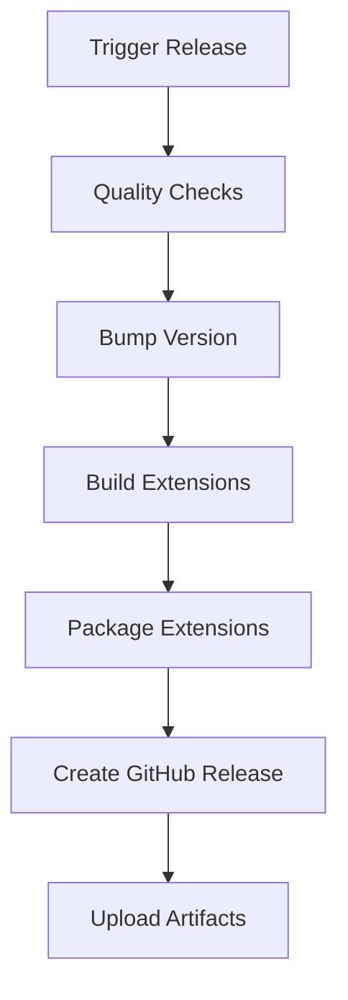

# 🚀 Release Process Guide

This guide covers how to create releases for the Distract Me Not browser extension.

## 📋 Quick Release (Recommended)

### Option 1: GitHub UI (Easiest)
1. Go to [GitHub Actions > Release Workflow](https://github.com/OttScott/distract-me-not/actions/workflows/release.yml)
2. Click **"Run workflow"**
3. Choose your release type:
   - **patch** - Bug fixes (3.1.1 → 3.1.2)
   - **minor** - New features (3.1.1 → 3.2.0)  
   - **major** - Breaking changes (3.1.1 → 4.0.0)
4. Click **"Run workflow"** button
5. ✨ Done! Check the [Releases page](https://github.com/OttScott/distract-me-not/releases) in ~5 minutes

### Option 2: Git Tag
```bash
git tag v3.1.2  # Replace with your version
git push origin v3.1.2
```

### Option 3: Local Preparation + GitHub Release
```bash
npm run release patch  # or minor/major
# Follow the instructions printed to create GitHub release
```

## 🔧 What Happens Automatically

### Quality Checks ✅
- Linting (ESLint)
- Unit tests
- Security scanning
- Build validation

### Version Management 📦
- Automatic version bumping in `package.json`
- Git tag creation
- Commit and push

### Multi-Browser Builds 🌐
- **Firefox** extension (.zip)
- **Chrome** extension (.zip)
- **Edge** extension (.zip)

### Release Creation 🚢
- GitHub release with auto-generated changelog
- All extension files attached
- Professional release notes
- Browser-specific download instructions

## 📊 Release Workflow Details



### Triggers
- **Manual**: GitHub Actions UI
- **Automatic**: Push git tag (`v*.*.*`)
- **Local**: `npm run release`

### Build Matrix
The workflow builds extensions for all browsers in parallel:
- Firefox (standard build)
- Chrome (with Chrome-specific service worker)
- Edge (Chrome-compatible build)

## 🛠️ Manual Release (Advanced)

If you need more control:

```bash
# 1. Prepare locally
npm run release patch

# 2. Review generated files
ls -la *.zip

# 3. Create release manually
gh release create v3.1.2 \
  --title "🚀 Release v3.1.2" \
  --notes "Bug fixes and improvements" \
  *.zip
```

## 🔍 Troubleshooting

### Build Fails
- Check the Actions tab for detailed logs
- Run `npm run release` locally to test
- Ensure all dependencies are up to date

### Version Conflicts
- Use "Force release" option to bypass checks
- Manually fix version in `package.json` if needed

### Missing Files
- Check that `package:*` scripts work locally
- Verify build outputs in `build/` directory

## 📋 Pre-Release Checklist

- [ ] All tests passing locally
- [ ] Security scan clean
- [ ] Extension works in all browsers
- [ ] README.md is up to date
- [ ] CHANGELOG.md updated (if you maintain one)

## 🔄 Release Schedule

### Recommended Schedule
- **Patch releases**: As needed for bugs
- **Minor releases**: Monthly for new features  
- **Major releases**: Quarterly or for breaking changes

### Emergency Releases
Use the "Force release" option to bypass quality checks when needed for critical security fixes.

## 📞 Need Help?

- Check [GitHub Actions logs](https://github.com/OttScott/distract-me-not/actions)
- Review [package.json scripts](./package.json)
- Test locally: `npm run release patch`

---

*Last updated: August 2025*
